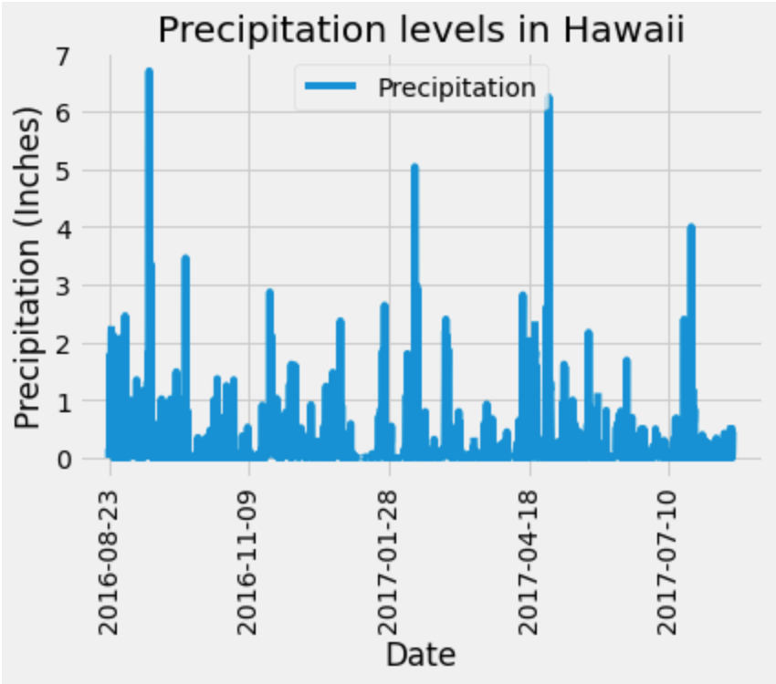
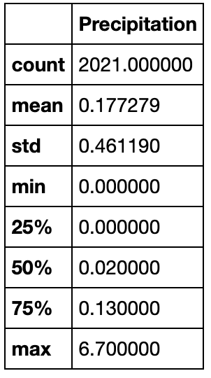
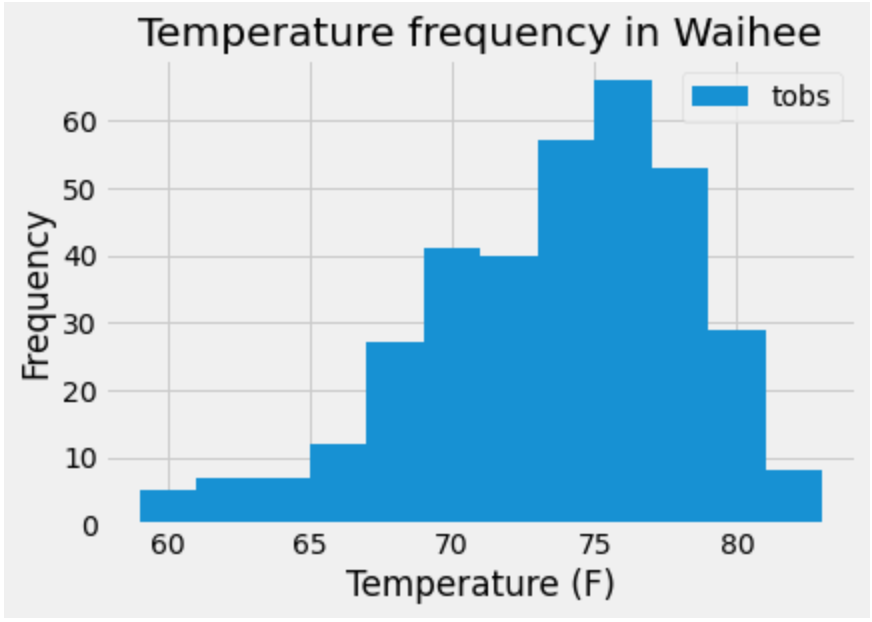
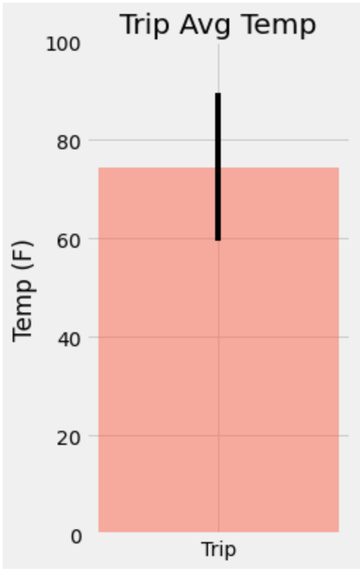
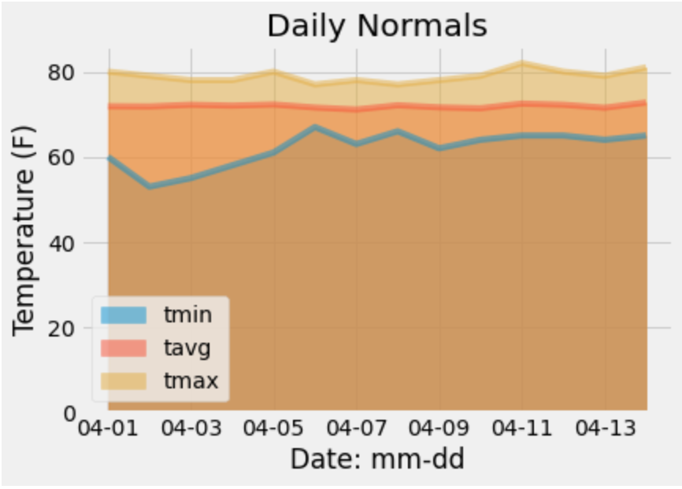

# SQLAlchemy-Challenge

## Task

To conduct a climate analysis of Honolulu, Hawaii using data from a SQLite database. The data exploration will include precipitation analysis, station analysis, temperature analysis and the analysis of daily rainfall averages. A flask app is then designed based on the developed queries with multiple routes displaying relevant data as JSON response objects.

## Technologies 

- Python
- Pandas
- Matplotlib
- SQLAlchemy
- ORM queries
- Flask

## Climate Analysis

### Precipitation Analysis

Queries the last 12 months of precipitation data creating a Date vs. Precipitation plot and a summary statistics table.

### Station Analysis

Queries the database to calculate the number of total stations, find the most active stations and visualise 12 months of temperature observation data for the most active station.

### Temperature Analysis I

Queries the database to determine if there is a meaningful difference between Hawaii's temperature in June and December.

#### Result

The average temperature recorded across all stations in June is 74.94 degrees Fahrenheit.
The average temperature recorded across all stations in December is 71.04 degrees Fahrenheit.

A t-score of 31.6 means that the two groups of data are 31.6 times as different from each other as they are within each other. The incredibly small p-value of 3.9e-191 indicates that the difference between the means of the two groups of weather data is statistically signficant. We then reject the null hypothesis of equal averages and conclude that the differences between the data sets did not occur by chance.

### Temperature Analysis II

Quering the database for the most recent length of time that matches the day and month of a proposed trip. A function is used to calculate the minimum, maximum and average temperatures for this period.

### Daily Rainfall Average

Continuing to analyse the days and month of a proposed trip in relation to rainfall per weather station and daily normals.

## Climate App

A flask app which provides information based on the queries developed above. 

### Routes

* `/`

  * Home page.

  * List all routes that are available.

* `/api/v1.0/precipitation`

  * Converts the precipitation query results to a dictionary using `date` as the key and `prcp` as the value.

  * Returns the JSON representation of the dictionary.

* `/api/v1.0/stations`

  * Returns a JSON list of stations from the dataset.

* `/api/v1.0/tobs`
  * Queries the dates and temperature observations of the most active station for the last year of data.
  
  * Returns a JSON list of temperature observations (TOBS) for the previous year.

* `/api/v1.0/<start>` and `/api/v1.0/<start>/<end>`

  * Returns a JSON list of the minimum temperature, the average temperature, and the max temperature for a given start or start-end range.

  * When given the start only,  `TMIN`, `TAVG`, and `TMAX` for all dates greater than and equal to the start date are calculated.

  * When given the start and the end date, the `TMIN`, `TAVG`, and `TMAX` for dates between the start and end date inclusive are calculated.

## Viewing

To view the flask app on a local machine, navigate to the directory which contains the file and run `python app.py` in terminal.
